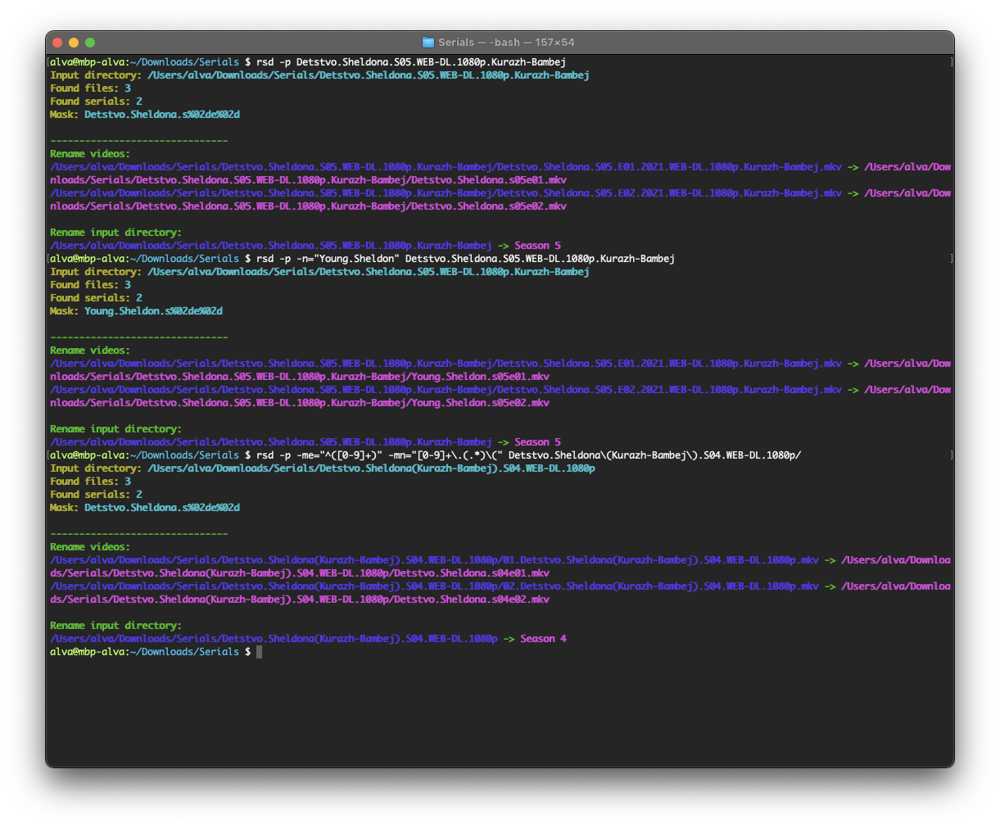

# App rename serial
Console application for rename serial file

### [Install](./docs/INSTALL.md)

### Options
* ```--preview, -p``` - preview (don't rename)
* ```--debug, -d``` - print debug
* ```--name, -n``` - set name serial (mask name ignore)
* ```--mask-name, -mn``` - set regexp mask for name (default: "(.*)\\.[s|S]")
* ```--mask-season, -ms``` - set regexp mask for number season (default: "[s|S]([0-9]+)")
* ```--mask-episode, -me``` - set regexp mask for number episode (default: "[e|E]([0-9]+)")
### Run
```shell
# preview
rsd -p {dir}

# rename
rsd {dir}

# rename with set name  
rsd -p -n="{name}" {dir}

# rename with set mask for episode and serial name 
rsd -p -me="^([0-9]+)" -mn="[0-9]+\.(.*)\(" {dir}
```

